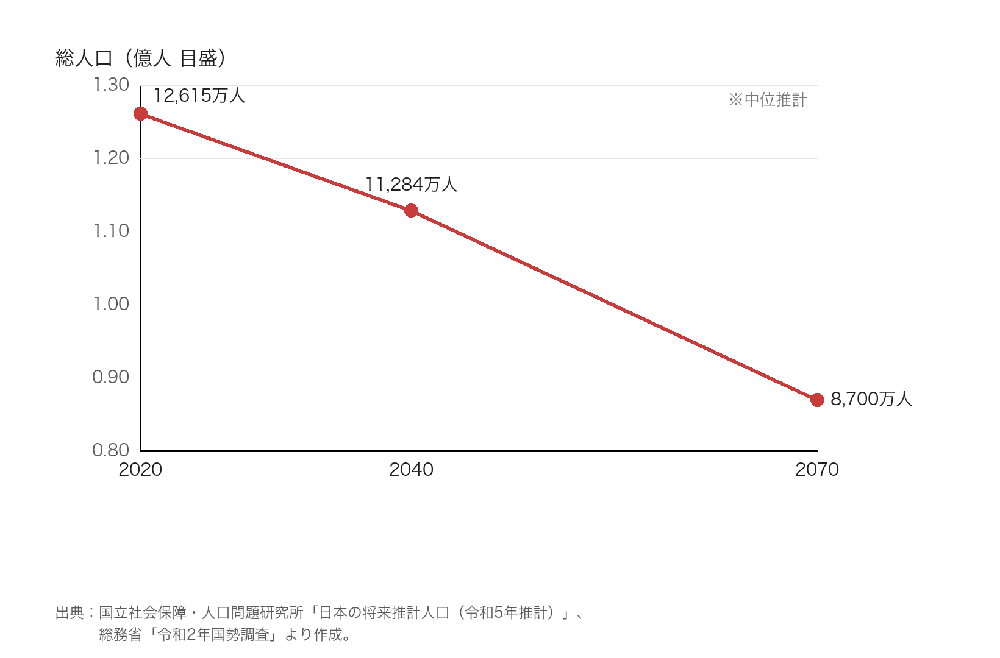

# はじめに

本稿の主張は明快である。**2040年までに、日本の総人口は2020年と比べて少なくとも約1割減少する。** これは悲観論でも予言でもなく、国が公表した最も標準的な推計をたどれば自然に導かれる結論である。

根拠の中心に置くのは、国立社会保障・人口問題研究所（社人研）が2023年4月に公表した「日本の将来推計人口（令和5年推計）」である。この推計は、2020年の国勢調査の確定値を出発点とし、出生・死亡・国際人口移動という三つの要因に仮定を置いて将来を投影したものだ。本稿では、その中位推計を軸に、なぜ「1割減」が避けられないのかを順に示す。

# 第1章　出発点としての2020年

議論の土台は、2020年の総人口である。総務省の国勢調査によれば、この年の日本の総人口は **1億2,615万人** だった。外国人を含む、日本に3か月以上住む人すべてを数えた値である。

すでにこの時点で、日本の人口は減少局面に入っていた。折り返しは、もう過ぎている。2008年前後をピークに、出生数が死亡数を下回る「自然減」が続いてきたからだ。つまり2020年は「減り始めた後の途中経過」であって、これから反転する見込みは、少なくとも数値の上では立っていない。

# 第2章　2040年の姿

社人研の中位推計によれば、総人口は2020年の1億2,615万人から、**2040年には約1億1,284万人** へと減少する。差し引き **およそ1,330万人、率にして約10.5%の減少** だ。本稿の主張「少なくとも1割減」は、この中位推計をなぞるだけで導ける。

減るのは総数だけではない。年齢の構成も大きく傾く。65歳以上が人口に占める割合（高齢化率）は、2020年の **28.6%** から一貫して上昇し、2040年には約35%に達する見込みで、「10人に3〜4人が高齢者」という社会が現実味を帯びる。しかも、それほど先の話ではない。2040年は、いまの中学生が働き盛りを迎えるころだ。

なお、この推計はあくまで中位、すなわち「真ん中の見通し」である。出生率をより低く見積もる低位推計では、減少はさらに大きくなる。したがって「1割減」は、厳しめの想定ではなく、むしろ**控えめな下限**として理解するのが正確だ。

# 第3章　なぜ減るのか

人口が減る仕組みは単純である。生まれる人より亡くなる人が多ければ、総数は減る。問題は、その差が今後さらに開くと見込まれることだ。

鍵を握るのが出生率である。一人の女性が生涯に産む子どもの数の目安である合計特殊出生率は、2023年に **1.20** まで下がり、過去最低を更新した。人口を長期に維持するには約2.07が必要とされるから、現状はその6割に満たない。

「移民を増やせば補えるのではないか」という疑問もあるだろう。実際、令和5年推計は前回より外国人の入国超過を多めに見込んでいる。しかし社人研自身が、それによって人口減少の進行は「わずかに緩和」されるにとどまると述べている。流入の増加は減少の速度を少し和らげるが、方向そのものを反転させる規模ではない。

さらに、人口減少には**慣性（人口モメンタム）**が働く。2040年に子どもを産む中心世代となるのは、およそ2010年代までに生まれた人々である。つまり2040年の親世代の規模は、**すでにおおむね確定している**。仮に明日から出生率が急回復しても、その効果が総人口に現れるまでには数十年かかり、2040年の到達点をほとんど動かせない。ここに「1割減」を確からしいものにする、もう一つの理由がある。

# 第4章　「1割減」が意味すること

数字の1割は小さく見えるかもしれない。だが中身を見ると、影響は数字以上に重い。

第一に、**支え手が総数より速く細る**。減るのは主に働く世代（生産年齢人口）であり、増えるのは高齢世代である。総数が1割減る一方で、高齢化率は28.6%から約35%へ上がる。つまり「分母（総人口）が縮み、分子（高齢者）が膨らむ」ため、現役世代一人あたりの負担は総数の減少率をはるかに上回る速さで重くなる。かつて多くの現役で一人の高齢者を支えた「騎馬戦」型の構図は、少人数で支える「肩車」型へと近づいていく。

第二に、**地域差が大きい**。全国平均で1割でも、その減り方は一様ではない。東京圏など一部が横ばいに近い一方、地方では2割・3割と減る自治体が続出する。人口が一定の規模を下回ると、店舗・医療・公共交通といった生活基盤の維持が難しくなり、減少がさらなる転出を招く悪循環に陥りやすい。

第三に、**社会保障の前提が揺らぐ**。年金・医療・介護は、いずれも「多くの現役が少数の高齢者を支える」比率を前提に設計された。その比率が崩れれば、給付と負担のどちらか、あるいは両方の見直しが避けられない。先送りできる話ではない。

つまり「1割減」は、単に人が減るという話ではなく、社会の支え方そのものを組み替える必要がある、という警告なのである。

# 第5章　それでも打てる手はある

もっとも、2040年の総数がほぼ決まっているとしても、その影響を和らげる手立てまで閉ざされているわけではない。問いの立て方が変わるだけだ。論点は「人口を増やす」ことから、「減っても回る社会をどうつくるか」へと移る。

一つは、**支え手の裾野を広げる**ことだ。子育てと仕事を両立しやすくし、働く意思のある女性や高齢者が力を発揮できるようにすれば、総人口が減っても働く人の数の落ち込みは緩められる。二つめは、**一人あたりの生産性を高める**ことである。省力化や機械・情報技術の活用によって、少ない人手でも同じ成果を出せれば、支え手が細っても暮らしの水準を保ちやすい。三つめは、**外国人材を含めた受け入れの設計**である。前述のとおり流入だけで減少は止まらないが、地域や産業の担い手として一定の役割は果たしうる。

これらはいずれも即効薬ではない。だが、避けられない「1割減」を前提に置いたうえで、いま何を積み上げるかによって、2040年の社会の姿は確実に変わる。

# おわりに

ここまで見てきたように、2020年の1億2,615万人という出発点、2040年に約1億1,284万人まで下がる中位推計、1.20という低い出生率、そして人口減少の慣性——これらを重ね合わせれば、**2040年までに少なくとも約1割の減少**という見通しは、十分な裏づけをもつ。

この数字を「決まった運命」として諦める必要はない。避けられない部分と、まだ動かせる部分を切り分け、後者に手を打つ。そこから先は、私たちの選択の問題だ。本稿がその出発点になれば幸いである。

# 参考文献

（ウェブ資料のURLは2026年8月19日参照）

1. 国立社会保障・人口問題研究所「日本の将来推計人口（令和5年推計）」2023年4月26日公表。<https://www.ipss.go.jp/pp-zenkoku/j/zenkoku2023/pp_zenkoku2023.asp>
2. 厚生労働省「日本の将来推計人口（令和5年推計）結果の概要」。<https://www.mhlw.go.jp/content/12601000/001091139.pdf>
3. 内閣府「将来推計人口（令和5年推計）の概要」。<https://www.cas.go.jp/jp/seisaku/kodomo_mirai/dai2/sankou.pdf>
4. 厚生労働省「令和5年（2023）人口動態統計（確定数）の概況」（合計特殊出生率1.20）。<https://www.mhlw.go.jp/toukei/saikin/hw/jinkou/kakutei23/index.html>
5. 総務省統計局「令和2年国勢調査」（2020年の総人口1億2,615万人。上記1・3の推計の出発点）。<https://www.stat.go.jp/data/kokusei/2020/>
