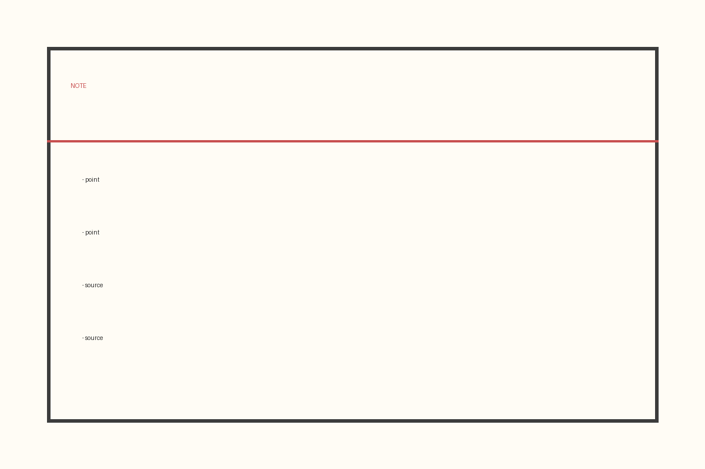

# はじめに

本書は、AIと一緒に一冊の本を作る流れを、実際に手を動かしながら学ぶための入門書です。難しい専門用語はできるだけ避け、初めての人でも読み進められるように書きました。

「本を書く」と聞くと身構えてしまうかもしれません。けれども、やることを小さな段階に分ければ、一つずつ越えていけます。本書ではその段階を、資料集め・構成・執筆・組版の順に見ていきます。

# 第1章　資料を集める

## 1-1　なぜ資料集めが最初なのか

書きたい気持ちだけで書き始めると、途中で手が止まります。理由の多くは「事実の裏づけが足りない」ことです。先に資料を集めておくと、筆が進みます。

信頼できる出典を選ぶこと。これが何より大切です。とくにインターネットの情報は、発行元と日付を必ず確認します。

## 1-2　集めた資料の整理

集めた資料は、そのままにせず、要点と出典をセットで記録します。あとで原稿に引用するとき、探し直す手間が消えます。

# 第2章　原稿を組版する

## 2-1　組版とは何か

組版とは、文字や図版を紙面に配置して、読みやすい形に整える作業です。フォント・文字の大きさ・余白を決めることで、同じ文章でも印象が大きく変わります。

## 2-2　LaTeXという選択肢

多くの出版社は、書籍の組版に **LaTeX（ラテフ）** という組版システムを使います。文章と体裁を分けて管理できるため、長い本でも体裁が崩れにくいのが利点です。原稿をLaTeX形式で渡せると、その後の工程がなめらかになります。

# おわりに

ここまで、資料集めから組版までの流れをたどってきました。小さな段階に分ければ、本づくりは決して難しくありません。次はあなた自身のテーマで、一冊を作ってみてください。
